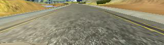

# **Behavioral Cloning** 

### Solution design

I decided right from the start to use the NVIDIA end-to-end network, but was surprised by how poorly it performed when I trained it only on the training data provided. Even collecting "recovery data" by driving off the track and then recording myself driving back on didn't really help much.

My mentor shared [this article](https://medium.com/@ksakmann/behavioral-cloning-make-a-car-drive-like-yourself-dc6021152713) with me, which was very helpful. I wasn't able to implement all the ideas in the article, but it gave me some really good ideas about data augmentation. That was what made all the difference: by randomly shearing and flipping images in my training set, I was able to achieve vastly improved performance. 

This was a really good illustration of how the hardest part of machine learning is often not algorithm design but actually data collection/organization.

### Data augmentation

The data augmentation steps I applied are as follows (inspired by the article referenced above).

To generate a new image from an existing training image, I simulate a random coin toss using python's `random.choice` method. Based on this outcome, I either shear the image or not. Then I simulate another coin toss and either flip the image or not. I then apply a random gamma adjustment using [this code](https://stackoverflow.com/a/41061351/3220303).

My preprocessing steps include cropping the image to an area of interest (basically removing the top third of the screen which is irrelevant scenery and also the bottom 10% which is occluded by the front of the car). I also resize my images to 64x64 which is the input size for the NVIDIA CNN.

#### Original Image

#### Cropped Image

#### Flipped Image

#### Gamma Adjusted Image

#### Fully Augmented Image

### Model architecture

(My implementation of) the NVIDIA end-to-end CNN is pretty simple. It has 5 convolutional layers of increasing depth. After that, the output is flattened, and then run through 5 fully connected layers of decreasing size. The final layer ouputs just a single number, the steering angle.

The network is reminiscent of LeNet, but with more convolutional layers and more fully connected layers.

I use relu activations throughout, and apply max pooling on the output of each convolutional layer. I use a mean squared error loss function (which is appropriate for a logistic output like this one). The optimizer is Adam.

### Results

[Here is a video](https://youtu.be/Q3zMjvGSEHU) of the car successfully navigating the first track. 